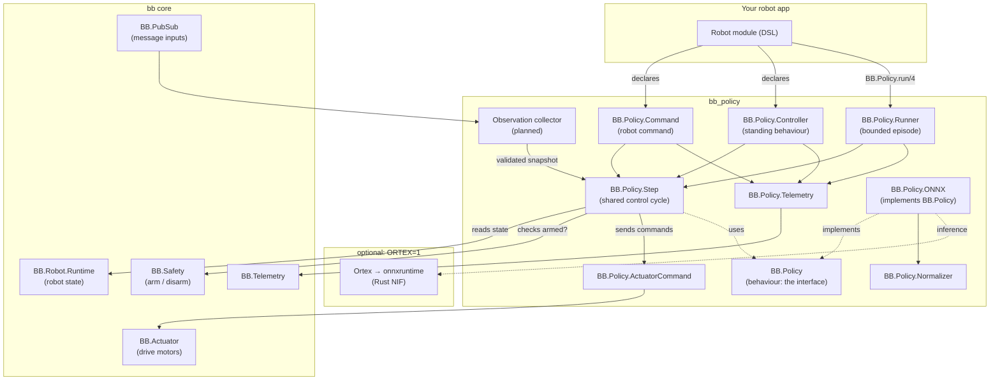
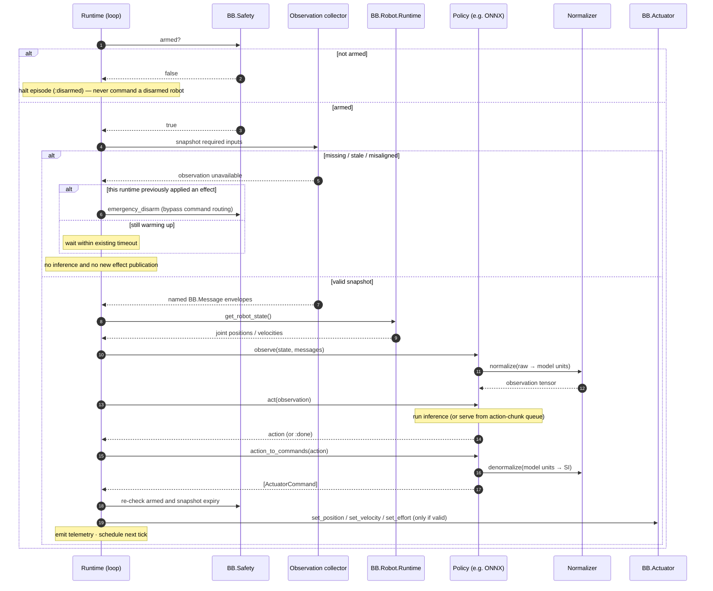

<!--
SPDX-FileCopyrightText: 2026 Edgar Gomes de Araujo <talktoedgar@gmail.com>

SPDX-License-Identifier: Apache-2.0
-->

# bb_policy — Design & Architecture

`bb_policy` lets a robot run a *learned behaviour* — a neural network that looks
at what the robot senses and decides what it should do — on the Erlang VM, in
the same process tree that controls the hardware, with the safety system in the
loop.

In one breath: train a policy elsewhere (Python), export it to a portable model
file (ONNX), drop it onto a Beam Bots robot, and run it at a fixed control rate
— as a one-shot task, a named robot command, or a standing controller. A crashed
or slow policy can't take the robot down, because it lives inside the BEAM's
supervision model.

This document explains the architecture and the genuinely architectural
sub-systems. The decision log (D1–D10), risk register (R1–R5), and phased
roadmap/status live in [`PROJECT_PLAN.md`](PROJECT_PLAN.md); the contributor
conventions live in `AGENTS.md`. This page complements them rather than
repeating them.

## 1. Context & the problem

Most robot motion is *explicitly programmed*: "move joint 3 to 1.2 radians, then
close the gripper." That works for repeatable, structured tasks. It falls apart
for things like dexterous manipulation, grasping novel objects, or compliant
motion — situations with too many contact states and variations to enumerate by
hand.

For those, the field has moved to **learning from demonstration**: a human (or a
simulator) shows the robot the task many times, and a neural network learns the
mapping from *what the robot perceives* to *what it should do*. That mapping is
called a **policy**. `bb_policy` is the piece that *runs* such a policy on real
Beam Bots hardware.

`bb_policy` is a **satellite package** of
[Beam Bots core (`bb`)](https://github.com/beam-bots/bb) — an Elixir framework
for resilient robotics. Core owns the robot model, supervision tree, safety
system, and actuator/sensor plumbing. `bb_policy` depends only on core's public
API and adds the policy-running machinery. It deliberately does *not* do
training, datasets, teleoperation, or vision — those are separate packages.

### Glossary

If you're coming from web/backend rather than robotics or reinforcement
learning, start here.

- **Policy** — a function `π: observation → action`. Given what the robot
  senses, it returns what to do. Here it's almost always a neural network.
- **Observation** — the policy's model-ready input tensors. `observe/3` builds
  them from robot state and a named snapshot of complete `BB.Message` envelopes
  so timestamps, source node, frame identity, and payload remain available for
  validation and preprocessing.
- **Action** — the policy's output: the commands to send to the motors — e.g.
  target joint positions or velocities.
- **Joint / actuator** — a *joint* is a movable connection (an elbow); an
  *actuator* is the motor that drives it. "Set joint to 1.2 rad" is an actuator
  command.
- **Control loop / rate (Hz)** — a robot is controlled by repeating "sense →
  decide → act" many times a second. 20 Hz means 20 times per second (every
  50 ms). That repeat is the *control loop*.
- **Inference** — running the trained neural network once to turn an observation
  into an action. (As opposed to *training*, which is how the network learned,
  done elsewhere.)
- **ONNX** — Open Neural Network Exchange — a portable file format for trained
  models. Train in PyTorch/JAX, export to `.onnx`, run anywhere that has an ONNX
  runtime.
- **ACT / action chunking** — "Action Chunking with Transformers", a popular
  imitation-learning method. Instead of predicting one action, it predicts a
  short *chunk* of future actions at once. See [§4](#4-key-sub-systems).
- **Normalisation** — neural nets expect inputs scaled to a standard range (e.g.
  mean 0, std 1). Normalisation converts raw sensor units ↔ the scaled values
  the net was trained on. See [§4](#4-key-sub-systems).
- **Arm / disarm (safety)** — a robot is *armed* when it's allowed to move and
  *disarmed* when motors are inhibited. Disarming is the emergency-stop concept.
  `bb_policy` gates effect publication on the observed safety state; actuator
  disarm callbacks provide the hardware-specific safety response.
- **BEAM / OTP** — the Erlang virtual machine (BEAM) and its framework (OTP). It
  runs many tiny isolated processes with supervisors that restart crashed ones —
  which is why a faulty policy can't crash the whole robot.
- **GenServer / Behaviour** — OTP building blocks. A *GenServer* is a stateful
  server process. A *Behaviour* is an interface (a set of callbacks a module
  must implement) — like a Java interface or a Rust trait.
- **Reactor** — a Beam Bots workflow tool for sequencing steps (with rollback).
  `bb_policy` makes a policy usable as one step in such a workflow.

## 2. What was built

Nine modules, each with a single responsibility. The split is deliberate: the
*behaviour* (the interface) is separate from the *implementation* (ONNX), and
the shared *control step* is separate from the three different ways to *drive*
it.

| Module | Role | Kind |
|--------|------|------|
| `BB.Policy` | The behaviour (interface) every policy implements: `init / reset / observe / act / action_to_commands`. Also the `run/4` entry point. | behaviour |
| `BB.Policy.Step` | One iteration of the control cycle — observe → act → convert → apply. Shared by all three runtimes so the logic exists once. | core |
| `BB.Policy.Runner` | A GenServer that runs a policy as a **bounded episode** at a fixed rate. Backs `BB.Policy.run/4`. | runtime |
| `BB.Policy.Command` | Runs a policy as a named robot **command** — awaitable and usable in Reactor workflows. | runtime |
| `BB.Policy.Controller` | Runs a policy **continuously** as a supervised controller (a standing behaviour). | runtime |
| `BB.Policy.ONNX` | The flagship policy implementation: loads an ONNX model via Ortex, runs inference, handles action chunking. Optional dependency. | impl |
| `BB.Policy.Normalizer` | Scales observations into / actions out of the model's expected range (z-score, min-max, identity). Pure maths. | support |
| `BB.Policy.ActuatorCommand` | A small struct describing one motor command (path, kind, value); dispatched to core's actuator API. | support |
| `BB.Policy.Telemetry` | Emits `[:bb, :policy, …]` observability events (episode start/stop, per-tick inference time). | support |

## 3. Architecture

The package layers onto Beam Bots core. `bb_policy` modules call core services;
the optional ONNX runtime only loads when explicitly enabled (`ORTEX=1`).



### The control cycle (one tick)

Every runtime repeats the same control cycle, captured once in
`BB.Policy.Step`: validate inputs → observe → act → convert to commands → apply.
The crucial details are the **safety gate** and the **observation gate**: the
cycle only drives motors while the robot is armed and every required input is
fresh and aligned.



### Three ways to run the same policy

A single policy can be driven in three ways, depending on whether the behaviour
is a one-shot task, a step in a plan, or an always-on reflex. All three share
`BB.Policy.Step` — they differ only in *lifecycle* and *how the safety system
reaches them*.

| | `Runner` | `Command` | `Controller` |
|--|----------|-----------|--------------|
| Built on | plain GenServer | `use BB.Command` | `use BB.Controller` |
| Lifespan | bounded episode | bounded episode | continuous (standing) |
| Started by | `BB.Policy.run/4` | robot DSL `commands` | robot DSL `controllers` |
| Ends on | done / timeout / disarm / unavailable observation | done / timeout / disarm / unavailable observation | never (requests disarm and resets on unavailable observation) |
| Reactor-usable | no | **yes** | no |
| Use it for… | "run this task now, tell me the result" | "pick_mug as a step in make_coffee" | "keep balancing while powered" |

### Episode lifecycle (Runner / Command)

```mermaid
stateDiagram-v2
  [*] --> Init
  Init --> Warmup: policy init ok then reset
  Init --> [*]: policy init error
  Warmup --> Warmup: required inputs unavailable
  Warmup --> Running: first effect published
  Warmup --> Completed: act returns done before first effect
  Warmup --> TimedOut: deadline or command timeout
  Warmup --> Disarmed: safety disarm or never armed
  Warmup --> Failed: action conversion error
  Running --> Running: tick while armed then apply commands
  Running --> Completed: act returns done
  Running --> TimedOut: deadline or command timeout
  Running --> Disarmed: safety disarm or never armed
  Running --> Failed: action conversion error
  Running --> ObservationLost: required input invalid; emergency disarm
  Completed --> [*]
  TimedOut --> [*]
  Disarmed --> [*]
  Failed --> [*]
  ObservationLost --> [*]
```



A `Controller` has no terminal states: it loops forever, idling while disarmed
and treating `{:done, _}` as "reset and keep going." Loss of a required
observation requests disarm and resets policy state; recovery does not re-arm
the robot automatically.

### Observation inputs and snapshots (planned)

Issue [#9](https://github.com/beam-bots/bb_policy/issues/9) tracks the missing
message-input path. Today every runtime passes `%{}` to `observe/3`; the
contract below defines the intended replacement before implementation.

#### Policy-owned input declaration

Input requirements belong to the policy because they are part of its trained
observation contract. `BB.Policy` gains an optional `inputs/1` callback, called
once after `init/1`. Existing joint-only policies default to no message inputs.

```elixir
@type input_source :: %{
        required(:path) => [atom()],
        required(:message_type) => module(),
        required(:max_age_ms) => pos_integer()
      }

@type input_config :: %{
        required(:sources) => %{atom() => input_source()},
        optional(:sync_tolerance_ms) => pos_integer(),
        optional(:collector_max_queue) => pos_integer()
      }

@callback inputs(state()) :: input_config()
@optional_callbacks inputs: 1
```

The collector returns a validated runtime value rather than exposing a bare map
to the effect-applying step:

```elixir
%BB.Policy.ObservationSnapshot{
  messages: %{alias => %BB.Message{}},
  collector: collector_pid,
  generation: collector_generation,
  expires_at_ns: earliest_expiry
}
```

`BB.Policy.Step` receives this snapshot, revalidates its generation and expiry,
and passes only `snapshot.messages` to `observe/3`. Source-path and collector
metadata therefore cannot be omitted by an external fourth-argument map.

The default is `%{sources: %{}}`. The returned aliases and paths are fixed for
the runtime process's lifetime; changing them requires a restart. A reusable
policy receives deployment-specific paths through `policy_opts`, retains them
in its state, and exposes them from `inputs/1`:

```elixir
@impl BB.Policy
def inputs(state) do
  %{
    sources: %{
      front_camera: %{
        path: state.front_camera_path,
        message_type: BB.Perception.Message.Image,
        max_age_ms: 100
      },
      wrist_force: %{
        path: state.wrist_force_path,
        message_type: MyRobot.Message.WristForce,
        max_age_ms: 50
      }
    },
    sync_tolerance_ms: 20,
    collector_max_queue: 100
  }
end
```

Passing envelopes is a semantic change from the current `observe/3`
documentation, which describes bare sensor payloads. Although the shipped
runtimes have never populated that map, external callers can already pass a
fourth argument to `BB.Policy.Step.run/4`. Implementation makes `Step` an
internal runtime API whose fourth argument is `ObservationSnapshot`, requires a
versioned migration note, and updates issue #9 from sensor-name payloads to named
exact-path envelopes. Only policies that always receive `%{}` are unchanged.

Every declared source is required. `sync_tolerance_ms` is optional; when set,
the oldest and newest input timestamps in a snapshot must fall within that
window. Policies needing multiple independently-aligned groups require a future
extension rather than implicit grouping rules. `collector_max_queue` defaults
to 100 and defines when queued delivery is treated as overload rather than an
unbounded backlog.

#### Collection

Runner, Command, and Controller use the same collector implementation, with one
collector process owned and monitored by each runtime instance. It subscribes
to each exact path and remains responsive while policy inference blocks its
caller. This keeps high-rate camera frames out of the policy process mailbox.

The collector:

- Stores complete `%BB.Message{}` envelopes, not bare payloads.
- Subscribes with the configured `message_type` filter and accepts only that
  type on the configured exact source path, even though BB's hierarchical
  PubSub may also deliver descendant paths to that subscription.
- Rejects cross-node envelopes before comparing timestamps. It records the
  affected alias as cross-node until a valid local envelope arrives, because
  monotonic timestamps from different nodes cannot be ordered.
- Retains the local envelope with the greatest `monotonic_time` per alias, so a
  delayed older delivery cannot replace a newer sample.
- Checks its mailbox length while receiving. At `collector_max_queue`, it marks
  itself overloaded, drains queued source deliveries while retaining only the
  newest valid envelope per alias, and refuses snapshots until the queue falls
  below the threshold. This does not make BEAM mailboxes intrinsically bounded;
  it makes overload observable and prevents inference from a lagging cache.
- Does not query `BB.Perception.SampleStore` on the control-loop hot path;
  `bb_policy` remains able to consume any BB message without depending on
  `bb_perception`.

The runtime links to and monitors its collector. Before applying the first
effect it restarts a failed collector and returns to warm-up. Afterwards,
collector failure is handled like required-input loss. Every snapshot carries
the collector generation; immediately before effect publication the runtime
synchronously confirms that the same generation is alive and not overloaded,
so a delayed `:DOWN` message cannot let an otherwise unexpired snapshot pass.

#### Snapshot validity

At each tick the runtime obtains all cached envelopes against one local
`System.monotonic_time(:nanosecond)` value. `observe/3` receives
`%{alias => %BB.Message{}}` only after the snapshot passes these checks:

- **Missing:** no envelope has arrived for a required alias.
- **Stale:** an envelope's age exceeds that source's `max_age_ms`.
- **Cross-node:** the most recent delivery for an alias came from another node;
  monotonic clocks cannot be compared across nodes in v1.
- **Misaligned:** the timestamp span exceeds `sync_tolerance_ms`, when set.

`robot_state` remains the value returned by `BB.Robot.Runtime` and is not
atomically timestamp-aligned with the message snapshot. Model-specific payload
selection, frame conversion, tensor layout, resizing, and normalisation remain
the policy's `observe/3` responsibility.

An unavailable snapshot is represented consistently across runtimes:

```elixir
{:observation_unavailable,
 %{
   missing: [atom()],
   stale: %{atom() => non_neg_integer()},
   cross_node: [atom()],
   collector: nil | :overloaded | :down,
   misaligned: %{
     inputs: [atom()],
     span_ms: non_neg_integer(),
     tolerance_ms: pos_integer()
   } | nil
 }}
```

#### Runtime behaviour

- **Warm-up:** before this runtime has applied its first effect, an incomplete
  snapshot causes no inference or effect. Runner and Command keep waiting within
  their existing timeout; Controller idles. Warm-up does not disarm because this
  runtime has not yet affected hardware.
- **Runner and Command:** after the runtime has applied any effect, an
  unavailable snapshot calls a new safety-originated
  `BB.Safety.emergency_disarm/2`, then terminates with
  `{:error, {:observation_unavailable, details}}` after successful disarm.
- **Controller:** after applying an effect, an unavailable snapshot calls the
  same direct safety API and resets policy state once. It remains supervised but
  cannot resume effects until inputs recover and an operator or robot-specific
  command re-arms the robot. Activation remains latched across `:done` resets
  until disarm succeeds because the previous actuator command may remain active.
- **Mid-step expiry:** immediately before applying effects, the runtime rechecks
  both `BB.Safety.armed?/1` and the snapshot's earliest freshness deadline. If
  either is already invalid, it publishes no effect from that snapshot and
  requests emergency disarm only if this runtime previously applied an effect;
  otherwise it returns to warm-up.

`BB.Safety.emergency_disarm/2` is a planned core API that bypasses configurable
disarm-command routing and command-category capacity. It must immediately enter
`:disarming`, invoke every registered safety handler, and enter `:error` if any
handler fails. Core must also register every actuator's required `disarm/1`
callback automatically before a robot can arm. A disarm failure takes precedence
over the observation error and is reported as a safety failure.

The direct API is idempotent for concurrent intervention: `:disarming` and
`:disarmed` count as successful safety progress, while an existing or newly
entered `:error` is returned as the higher-priority failure. A standing
Controller reports genuine disarm failure through policy telemetry and leaves
the robot in `:error`; it has no bounded caller result to return.

Core also needs an arm epoch on asynchronous actuator commands. Each successful
arm creates a new epoch; transition to `:disarming` invalidates it before
callbacks run. `BB.Actuator` stamps each outgoing command with the current
epoch, and `BB.Actuator.Server` rejects missing or stale epochs before invoking
driver callbacks. A command queued before disarm therefore cannot run after the
callback or after a later re-arm. Safety registration is a continuous armed-state
invariant: losing an actuator handler while armed requests emergency disarm
rather than silently removing the only callback for that path.

The pre-publication checks are the best available runtime gate, not an atomic
hardware transaction. The arm epoch applies to built-in
`BB.Policy.ActuatorCommand` effects and other effects that use the core actuator
command path; it prevents those queued commands from crossing a disarm boundary.
Custom `BB.Policy.Effect` implementations do not inherit that guarantee. A
custom effect that can drive hardware must provide equivalent epoch validation
and safety registration, while non-hardware effects may document that no such
handling is needed. Hardware safety still depends on the safety state changing
and registered disarm callbacks running. Physical disarm behaviour remains
driver-defined; a gravity-loaded arm may hold while another mechanism removes
torque or brakes. Merely stopping policy effects is not a stop operation because
previous position targets may remain active and velocity or effort commands may
persist.

## 4. Key sub-systems

### Action chunking (and why it needs a queue)

A naïve policy predicts one action per tick. ACT-style policies instead predict
a **chunk** — a short sequence of future actions — in a single inference. This
produces smoother motion and means you don't have to run the (relatively
expensive) neural net on every single tick. But it raises a question: *how do
you turn one chunk of N actions into per-tick commands?* `bb_policy` implements
both standard answers.

**Receding-horizon queue (default).** Run inference once, push the predicted
chunk into a queue, then play it out one action per tick. When the queue empties,
infer again. Fewer inferences, lower compute — the cheap, robust default.

```text
tick 1 → infer → [a0, a1, a2]; play a0
tick 2 → play a1
tick 3 → play a2
tick 4 → infer again → …
```

**Temporal ensembling (opt-in).** Infer *every* tick. Multiple overlapping
chunks now each predict the current timestep; blend them with exponential
weights `wᵢ = exp(-coeff · age)`. Smoother and more reactive, at the cost of
inferring every tick. Enable with `temporal_ensemble_coeff:`.

```text
step1 = ( a@1.row0 · 1
        + a@0.row1 · e^(-coeff) )
        / (sum of weights)
```

*Why both:* the queue is correct and cheap for most cases and is the safe
default. Ensembling is what the original ACT work uses for the smoothest
results; offering it (off by default) means we don't force the compute cost on
everyone but support the high-quality path when wanted.

### Normalisation — and why the runtime owns it

A neural net trained on data where joint angles averaged 0.1 rad with a spread
of 0.5 expects inputs scaled the same way. The numbers needed to do that scaling
(means, standard deviations, min/max) are a property of the *training dataset*,
not the model graph.

The subtle part: tools like LeRobot **strip normalisation out of the exported
ONNX file** and ship the statistics separately (as JSON). So the runtime — not
the model — must re-apply them. `BB.Policy.Normalizer` loads those stats and
scales observations *in* and actions *out*. It also guards against
divide-by-zero on constant features (zero variance), which would otherwise
produce `NaN` and crash the robot mid-motion.

Three strategies, chosen per key:

- `:z_score` — mean 0 / std 1.
- `:min_max` — scale a known range to `[0, 1]` or `[-1, 1]`.
- `:identity` — passthrough.

### Safety — non-negotiable

A learned policy is a black box that could, in principle, output anything.
Four layers protect the hardware once the planned core prerequisites and
message inputs are implemented:

- **The gate:** every tick checks `BB.Safety.armed?/1` before publishing
  commands. Once the runtime observes disarm it publishes no further effect and
  the episode ends with reason `:disarmed`. This is treated as a deliberate
  intervention, not an error to retry.
- **The actuator boundary:** built-in actuator effects use the same actuator APIs
  as other controllers; policies do not gain a privileged hardware path. Limit
  checking remains an actuator-driver responsibility because core's asynchronous
  command publication does not universally clamp position, velocity, or effort.
- **The observation gate:** inference only starts with complete, fresh, aligned
  local inputs, and their expiry is checked again before effects are applied.
  Losing a required input after this runtime has applied an effect requests the
  direct emergency-disarm path because merely ceasing effects can leave a
  previous command active.
- **The arm epoch:** actuator servers reject asynchronous commands from a prior
  arm generation, preventing built-in actuator effects from crossing a disarm
  and re-arm boundary. Custom hardware effects require equivalent protection.

When run as a `Command` or `Controller`, the safety system reaches the policy
through core's own callbacks (a disarm stops a command with reason `:disarmed`,
which a Reactor workflow surfaces as `{:halt, :safety_disarmed}`).

## 5. Decisions & trade-offs

The choices that shaped the package — public entry point, the standalone-Runner-
then-Controller ordering, direct `Ortex.run/2` over batched serving,
runtime-owned normalisation, ACT-first scope, optional `ortex`, the
`ActuatorCommand` struct, `{:done, state}` completion, an options-configured
command handler, the Nix toolchain, and policy-owned observation inputs — are
recorded in the decision log in
[`PROJECT_PLAN.md`](PROJECT_PLAN.md#2-key-decisions). Each entry lists what was
decided, why, and what it costs.

## 6. Risk register

The risks surfaced by an up-front review of the ML stack on the Erlang VM —
on-robot (ARM/Nerves) deployment, the non-trivial LeRobot→ONNX export, inference
blocking the BEAM scheduler, silent CPU fallback, diffusion/VLA expectations,
and persistent actuator commands at policy termination — are tracked with
severities and mitigations in
[`PROJECT_PLAN.md`](PROJECT_PLAN.md#3-risks-from-the-ml-stack-review).

## 7. Status & what's next

Shipped and verified initially against `bb` 0.20 (the package now targets
`bb` 0.22): the behaviour, the shared control
step, all three runtimes (Runner / Command / Controller), the ONNX
implementation with both action-chunking regimes, normalisation, actuator
dispatch, and telemetry — 61 tests + 2 doctests, all quality gates green. The
Nerves / aarch64 path is proven on a Raspberry Pi Zero 2 W (latency ~12× under
the 20 Hz budget). The full phased roadmap, per-phase verification, and the
remaining deferred work (the observation collector defined above, a real ACT
model end-to-end, the `BB.Motion.run_policy/4` core PR, live DSL-robot
integration tests, multi-input models) are in
[`PROJECT_PLAN.md`](PROJECT_PLAN.md#4-phased-roadmap).
