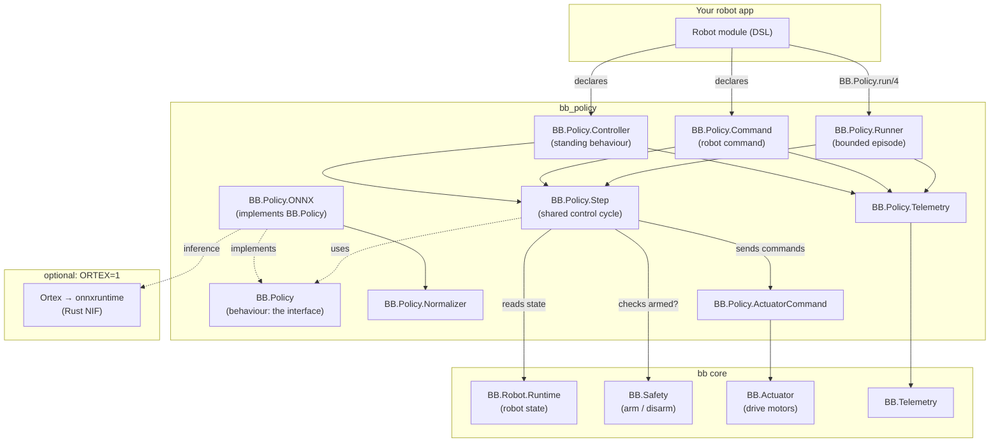
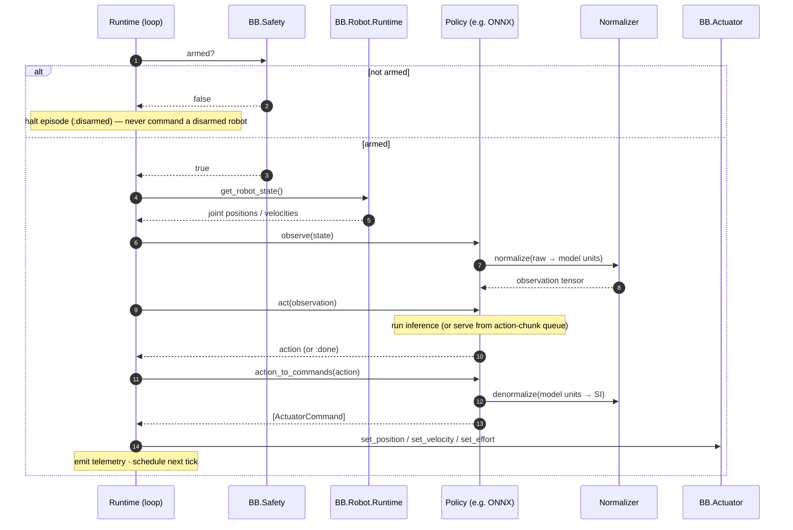
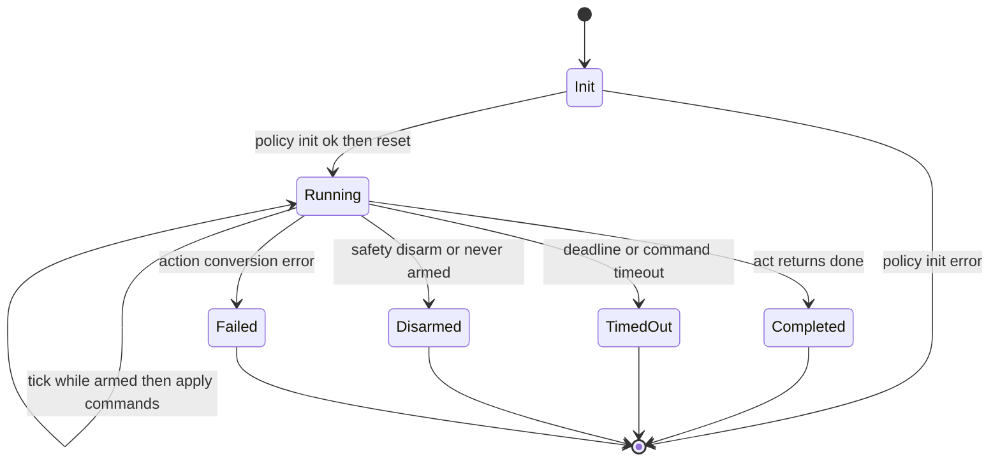

<!--
SPDX-FileCopyrightText: 2026 Edgar Gomes de Araujo <talktoedgar@gmail.com>

SPDX-License-Identifier: Apache-2.0
-->

# bb_policy — Design & Architecture

`bb_policy` lets a robot run a *learned behaviour* — a neural network that looks
at what the robot senses and decides what it should do — on the Erlang VM, in
the same process tree that controls the hardware, with the safety system in the
loop.

In one breath: train a policy elsewhere (Python), export it to a portable model
file (ONNX), drop it onto a Beam Bots robot, and run it at a fixed control rate
— as a one-shot task, a named robot command, or a standing controller. A crashed
or slow policy can't take the robot down, because it lives inside the BEAM's
supervision model.

This document explains the architecture and the genuinely architectural
sub-systems. The decision log (D1–D10), risk register (R1–R5), and phased
roadmap/status live in [`PROJECT_PLAN.md`](PROJECT_PLAN.md); the contributor
conventions live in `AGENTS.md`. This page complements them rather than
repeating them.

## 1. Context & the problem

Most robot motion is *explicitly programmed*: "move joint 3 to 1.2 radians, then
close the gripper." That works for repeatable, structured tasks. It falls apart
for things like dexterous manipulation, grasping novel objects, or compliant
motion — situations with too many contact states and variations to enumerate by
hand.

For those, the field has moved to **learning from demonstration**: a human (or a
simulator) shows the robot the task many times, and a neural network learns the
mapping from *what the robot perceives* to *what it should do*. That mapping is
called a **policy**. `bb_policy` is the piece that *runs* such a policy on real
Beam Bots hardware.

`bb_policy` is a **satellite package** of
[Beam Bots core (`bb`)](https://github.com/beam-bots/bb) — an Elixir framework
for resilient robotics. Core owns the robot model, supervision tree, safety
system, and actuator/sensor plumbing. `bb_policy` depends only on core's public
API and adds the policy-running machinery. It deliberately does *not* do
training, datasets, teleoperation, or vision — those are separate packages.

### Glossary

If you're coming from web/backend rather than robotics or reinforcement
learning, start here.

- **Policy** — a function `π: observation → action`. Given what the robot
  senses, it returns what to do. Here it's almost always a neural network.
- **Observation** — the policy's input: a bundle of numbers describing the
  robot's current state — joint angles, joint speeds, maybe a camera frame or
  force readings.
- **Action** — the policy's output: the commands to send to the motors — e.g.
  target joint positions or velocities.
- **Joint / actuator** — a *joint* is a movable connection (an elbow); an
  *actuator* is the motor that drives it. "Set joint to 1.2 rad" is an actuator
  command.
- **Control loop / rate (Hz)** — a robot is controlled by repeating "sense →
  decide → act" many times a second. 20 Hz means 20 times per second (every
  50 ms). That repeat is the *control loop*.
- **Inference** — running the trained neural network once to turn an observation
  into an action. (As opposed to *training*, which is how the network learned,
  done elsewhere.)
- **ONNX** — Open Neural Network Exchange — a portable file format for trained
  models. Train in PyTorch/JAX, export to `.onnx`, run anywhere that has an ONNX
  runtime.
- **ACT / action chunking** — "Action Chunking with Transformers", a popular
  imitation-learning method. Instead of predicting one action, it predicts a
  short *chunk* of future actions at once. See [§4](#4-key-sub-systems).
- **Normalisation** — neural nets expect inputs scaled to a standard range (e.g.
  mean 0, std 1). Normalisation converts raw sensor units ↔ the scaled values
  the net was trained on. See [§4](#4-key-sub-systems).
- **Arm / disarm (safety)** — a robot is *armed* when it's allowed to move and
  *disarmed* when motors are inhibited. Disarming is the emergency-stop concept.
  `bb_policy` never moves a disarmed robot.
- **BEAM / OTP** — the Erlang virtual machine (BEAM) and its framework (OTP). It
  runs many tiny isolated processes with supervisors that restart crashed ones —
  which is why a faulty policy can't crash the whole robot.
- **GenServer / Behaviour** — OTP building blocks. A *GenServer* is a stateful
  server process. A *Behaviour* is an interface (a set of callbacks a module
  must implement) — like a Java interface or a Rust trait.
- **Reactor** — a Beam Bots workflow tool for sequencing steps (with rollback).
  `bb_policy` makes a policy usable as one step in such a workflow.

## 2. What was built

Nine modules, each with a single responsibility. The split is deliberate: the
*behaviour* (the interface) is separate from the *implementation* (ONNX), and
the shared *control step* is separate from the three different ways to *drive*
it.

| Module | Role | Kind |
|--------|------|------|
| `BB.Policy` | The behaviour (interface) every policy implements: `init / reset / observe / act / action_to_commands`. Also the `run/4` entry point. | behaviour |
| `BB.Policy.Step` | One iteration of the control cycle — observe → act → convert → apply. Shared by all three runtimes so the logic exists once. | core |
| `BB.Policy.Runner` | A GenServer that runs a policy as a **bounded episode** at a fixed rate. Backs `BB.Policy.run/4`. | runtime |
| `BB.Policy.Command` | Runs a policy as a named robot **command** — awaitable and usable in Reactor workflows. | runtime |
| `BB.Policy.Controller` | Runs a policy **continuously** as a supervised controller (a standing behaviour). | runtime |
| `BB.Policy.ONNX` | The flagship policy implementation: loads an ONNX model via Ortex, runs inference, handles action chunking. Optional dependency. | impl |
| `BB.Policy.Normalizer` | Scales observations into / actions out of the model's expected range (z-score, min-max, identity). Pure maths. | support |
| `BB.Policy.ActuatorCommand` | A small struct describing one motor command (path, kind, value); dispatched to core's actuator API. | support |
| `BB.Policy.Telemetry` | Emits `[:bb, :policy, …]` observability events (episode start/stop, per-tick inference time). | support |

## 3. Architecture

The package layers onto Beam Bots core. `bb_policy` modules call core services;
the optional ONNX runtime only loads when explicitly enabled (`ORTEX=1`).



### The control cycle (one tick)

Every runtime repeats the same four-step cycle, captured once in
`BB.Policy.Step`: observe → act → convert to commands → apply. The crucial
detail is the **safety gate**: the cycle only ever drives motors while the robot
is armed.



### Three ways to run the same policy

A single policy can be driven in three ways, depending on whether the behaviour
is a one-shot task, a step in a plan, or an always-on reflex. All three share
`BB.Policy.Step` — they differ only in *lifecycle* and *how the safety system
reaches them*.

| | `Runner` | `Command` | `Controller` |
|--|----------|-----------|--------------|
| Built on | plain GenServer | `use BB.Command` | `use BB.Controller` |
| Lifespan | bounded episode | bounded episode | continuous (standing) |
| Started by | `BB.Policy.run/4` | robot DSL `commands` | robot DSL `controllers` |
| Ends on | done / timeout / disarm | done / timeout / disarm | never (resets on disarm) |
| Reactor-usable | no | **yes** | no |
| Use it for… | "run this task now, tell me the result" | "pick_mug as a step in make_coffee" | "keep balancing while powered" |

### Episode lifecycle (Runner / Command)



A `Controller` has no terminal states: it loops forever, idling while disarmed
and treating `{:done, _}` as "reset and keep going."

## 4. Key sub-systems

### Action chunking (and why it needs a queue)

A naïve policy predicts one action per tick. ACT-style policies instead predict
a **chunk** — a short sequence of future actions — in a single inference. This
produces smoother motion and means you don't have to run the (relatively
expensive) neural net on every single tick. But it raises a question: *how do
you turn one chunk of N actions into per-tick commands?* `bb_policy` implements
both standard answers.

**Receding-horizon queue (default).** Run inference once, push the predicted
chunk into a queue, then play it out one action per tick. When the queue empties,
infer again. Fewer inferences, lower compute — the cheap, robust default.

```text
tick 1 → infer → [a0, a1, a2]; play a0
tick 2 → play a1
tick 3 → play a2
tick 4 → infer again → …
```

**Temporal ensembling (opt-in).** Infer *every* tick. Multiple overlapping
chunks now each predict the current timestep; blend them with exponential
weights `wᵢ = exp(-coeff · age)`. Smoother and more reactive, at the cost of
inferring every tick. Enable with `temporal_ensemble_coeff:`.

```text
step1 = ( a@1.row0 · 1
        + a@0.row1 · e^(-coeff) )
        / (sum of weights)
```

*Why both:* the queue is correct and cheap for most cases and is the safe
default. Ensembling is what the original ACT work uses for the smoothest
results; offering it (off by default) means we don't force the compute cost on
everyone but support the high-quality path when wanted.

### Normalisation — and why the runtime owns it

A neural net trained on data where joint angles averaged 0.1 rad with a spread
of 0.5 expects inputs scaled the same way. The numbers needed to do that scaling
(means, standard deviations, min/max) are a property of the *training dataset*,
not the model graph.

The subtle part: tools like LeRobot **strip normalisation out of the exported
ONNX file** and ship the statistics separately (as JSON). So the runtime — not
the model — must re-apply them. `BB.Policy.Normalizer` loads those stats and
scales observations *in* and actions *out*. It also guards against
divide-by-zero on constant features (zero variance), which would otherwise
produce `NaN` and crash the robot mid-motion.

Three strategies, chosen per key:

- `:z_score` — mean 0 / std 1.
- `:min_max` — scale a known range to `[0, 1]` or `[-1, 1]`.
- `:identity` — passthrough.

### Safety — non-negotiable

A learned policy is a black box that could, in principle, output anything. Two
layers protect the hardware:

- **The gate:** every tick checks `BB.Safety.armed?/1` *before* applying
  commands. A robot that is disarmed — or disarms mid-episode — is never
  commanded; the episode ends with reason `:disarmed`. This is treated as a
  deliberate intervention, not an error to retry.
- **The envelope:** the commands a policy emits still pass through core's
  actuator system, which enforces the robot's joint and velocity limits. A bad
  action can't drive a motor outside its configured range.

When run as a `Command` or `Controller`, the safety system reaches the policy
through core's own callbacks (a disarm stops a command with reason `:disarmed`,
which a Reactor workflow surfaces as `{:halt, :safety_disarmed}`).

## 5. Decisions & trade-offs

The choices that shaped the package — public entry point, the standalone-Runner-
then-Controller ordering, direct `Ortex.run/2` over batched serving,
runtime-owned normalisation, ACT-first scope, optional `ortex`, the
`ActuatorCommand` struct, `{:done, state}` completion, an options-configured
command handler, and the Nix toolchain — are recorded in full as D1–D10 in
[`PROJECT_PLAN.md`](PROJECT_PLAN.md#2-key-decisions). Each entry lists what was
decided, why, and what it costs.

## 6. Risk register

The risks surfaced by an up-front review of the ML stack on the Erlang VM —
on-robot (ARM/Nerves) deployment, the non-trivial LeRobot→ONNX export, inference
blocking the BEAM scheduler, silent CPU fallback, and diffusion/VLA
expectations — are tracked as R1–R5 with severities and mitigations in
[`PROJECT_PLAN.md`](PROJECT_PLAN.md#3-risks-from-the-ml-stack-review).

## 7. Status & what's next

Shipped and verified against real `bb` 0.20: the behaviour, the shared control
step, all three runtimes (Runner / Command / Controller), the ONNX
implementation with both action-chunking regimes, normalisation, actuator
dispatch, and telemetry — 61 tests + 2 doctests, all quality gates green. The
Nerves / aarch64 path is proven on a Raspberry Pi Zero 2 W (latency ~12× under
the 20 Hz budget). The full phased roadmap, per-phase verification, and the
remaining deferred work (a real ACT model end-to-end, the `BB.Motion.run_policy/4`
core PR, live DSL-robot integration tests, multi-input models) are in
[`PROJECT_PLAN.md`](PROJECT_PLAN.md#4-phased-roadmap).
